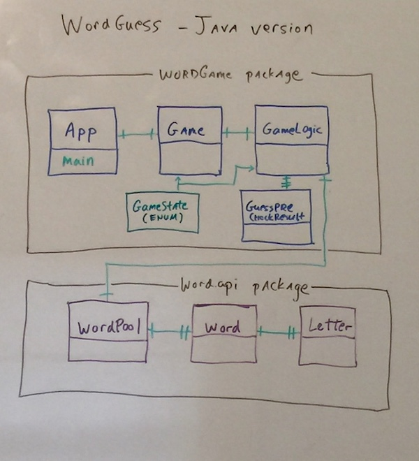
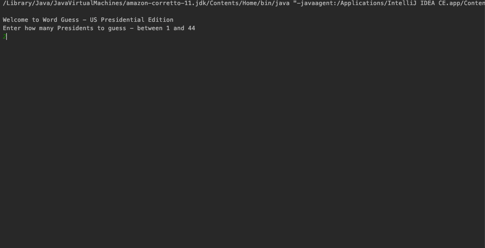

# Word-Guess 

## Java version of Presidential themed name guess game

Written in Java utilizing a simple CLI (command line interface)

## Description

This Java app has command line interface for playing a hangman style game using the US President names as a word set.

## Java features used
1. packages
2. instantiated classes
3. private and public methods
4. getters and setters
5. Array Lists
6. enum
7. wrapper classes
8. stream
9. lambda expression
10. regex
11. terminal scanner command line interface
 

## Game Format

1.  User is presented with a random presidential name to guess showing letters as underscores initially
2.  User can choose how many names to play between 1 and 44
    1. FYI - yes there have been 45 presidencies, but Grover Cleveland served in the 22nd and 24th presidency 
       hence there have been 44 individuals
3. User guess letter via keyboard - results revealed
    1. letter not in name
    2. letter in name - underscores replaced with letter
    3. letter already used - list of previously used letters shown
    4. letter in name and solved the word - message followed by next word
    5. repeat above until pool of presidential names exhausted.
    6. replay of the game will provide randomized order of names
4.  User presented with option to play again

## Details:

- #### Github project :   https://github.com/mylescarey2019/Word-Guess-Java
- #### For further development details see: 

  - ####  [UseCases and Pseudo Code](UseCases-PseudoCode.md)

  - ####  [Test Cases](TestCases.md)
  

 
## Class Model
      

## Demo GIF (shows abbreviated 2 word session) 
#### 

## Getting Started

### Third-Party/Custom libraries used
1.  none

### Dependencies

* Java IDE of your choice 

### Installing

* use project packages com.example.wordapi and com.example.wordgame

### Executing program

* run App for main method entry point

## Authors

Myles Carey 
mylescarey2019@gmail.com 

## Version History

* 1.0 - Initial Release - Java version based of previous TypeScript/JavaScript version
* 1.1 - 

## License

## Acknowledgments

